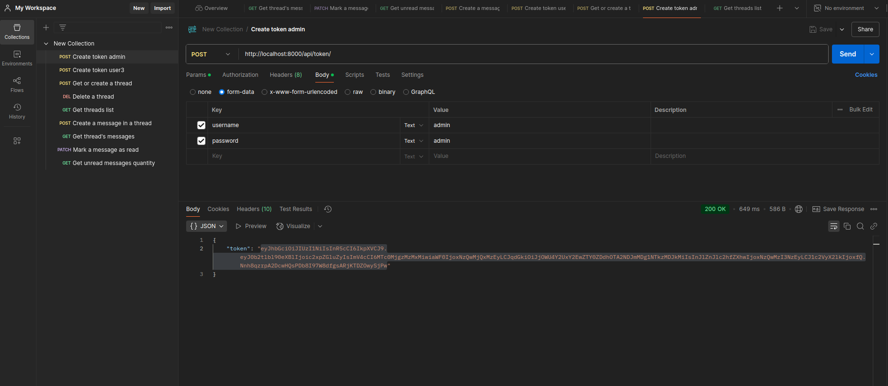
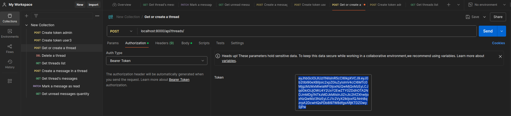

# My Django Chat

## How to Run

1. **Build the Docker image:**
   ```sh
   docker compose build
   ```
2. **Start the containers:**
   ```sh
   docker compose up -d
   ```
3. **Rename dump file `db_dump.sqlite3` to `db.sqlite3` to use test data:**
   
## Steps to Test
1. **Create admin token**
   - Send a `POST` request to `http://localhost:8000/api/token/` with username:admin and password:admin and save the token
   - You can use Postman or a browser

2. **Set up token to send requests**
3. **Create a thread with user4**[Create a thread with user4](./docs/screenshots/step_3_create_a_thread_with_user_4_status_code_201.png)
4. **Get a thread with user4**[Get a thread with user4](./docs/screenshots/step_4_get_a_thread_with_user_4_status_code_200.png)
5. **Delete a thread with id 10**[Delete a thread with id 10](./docs/screenshots/step_5_delete_a_thread_with_id_10_status_code_204.png)
6. **Check list of threads for thread_id 10**[Check list of threads for thread_id 10](./docs/screenshots/step_6_check_list_of_threads_for_thread_id_10_does_not_exist.png)
7. **Create a thread with user4 again**[Create a thread with user4 again](./docs/screenshots/step_7_create_a_thread_with_user_4_again.png)
8. **Check list of threads for thread id 11 exist**[Check list of threads for thread id 11 exist](./docs/screenshots/step_8_check_list_of_threads_for_thread_id_11_exist.png)
9. **Get messages from thread id 11**[Get messages from thread id 11](./docs/screenshots/step_9_get_messages_from_thread_id_11.png)
10. **Try to mark message id 30 as not read**[Try to mark message id 30 as not read](./docs/screenshots/step_10_try_to_mark_message_id_30_as_not_read_status_code_400.png)
11. **Try to mark own message as read stats code 400**[Try to mark own message as read stats code 400](./docs/screenshots/step_11_try_to_mark_own_message_as_read_status_code_400.png)
12. **Get auth token for user 4**[Get auth token for user 4](./docs/screenshots/step_12_get_auth_token_for_user_4.png)
13. **Try to mark other user message as read status code 200**[Try to mark other user message as read status code 200](./docs/screenshots/step_13_try_to_mark_other_user_message_as_read_status_code_200.png)
14. **Check unread message count**[Check unread message count](./docs/screenshots/step_14_check_unread_message_count.png)
15. **Create and check new message in thread**[Create and check new message in thread](./docs/screenshots/step_15_create_and_check_new_message_in_thread.png)
16. **Check again unread message count increased**[Check again unread message count increased](./docs/screenshots/step_16_check_again_unread_message_count_increased.png)
17. **Handle url 404 as json**[Handle url 404 as json](./docs/screenshots/step_17_handle_url_404_as_json.png)

---

## Description

### Simple Chat Application
Two main models:

- **Thread**
  - Fields: `participants, created, updated`
  - A thread can't have more than 2 participants

- **Message**
  - Fields: `sender, text, thread, created, is_read`

### API Endpoints:
1. **Thread management:**
   - Create a thread (if a thread with particular users exists - just return it.)
   - Delete a thread
   - Retrieve a user's thread list

2. **Message management:**
   - Create a message
   - Retrieve message list for a thread
   - Mark a message as read
   - Retrieving a number of unread messages for the user.
---

## Tech Stack
- **Backend:** `Django, Django REST Framework`
- **Authentication:** `Simple JWT`
- **Database:** `SQLite`
- **Containerization:** `Docker`

---